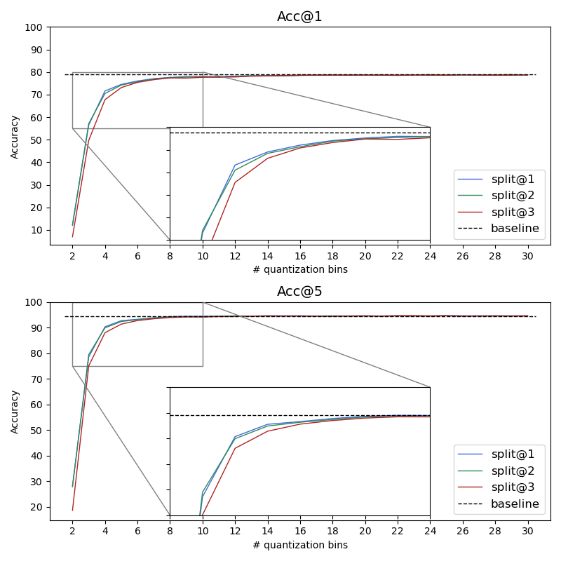
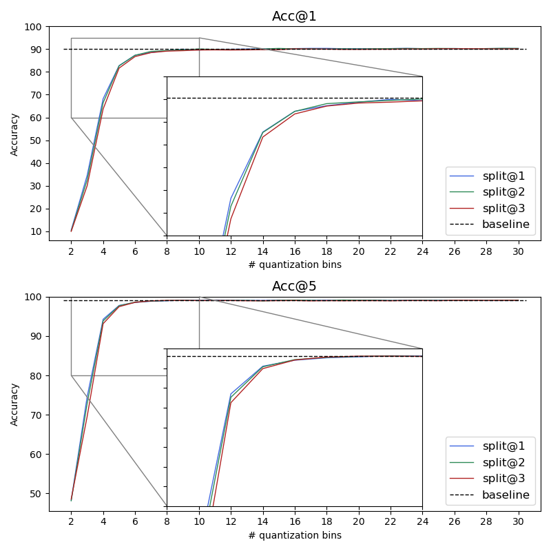
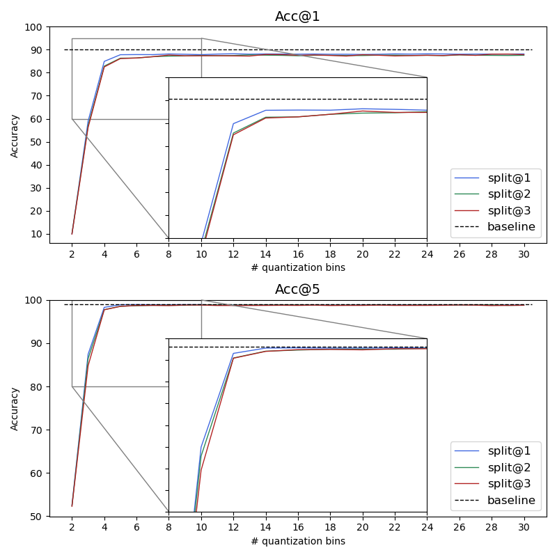
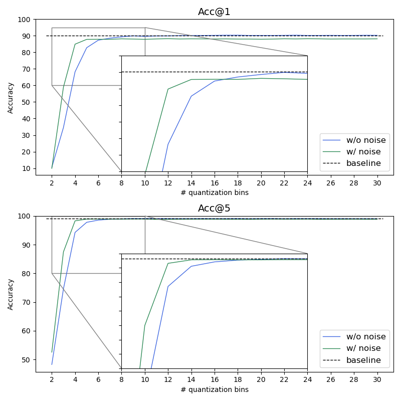
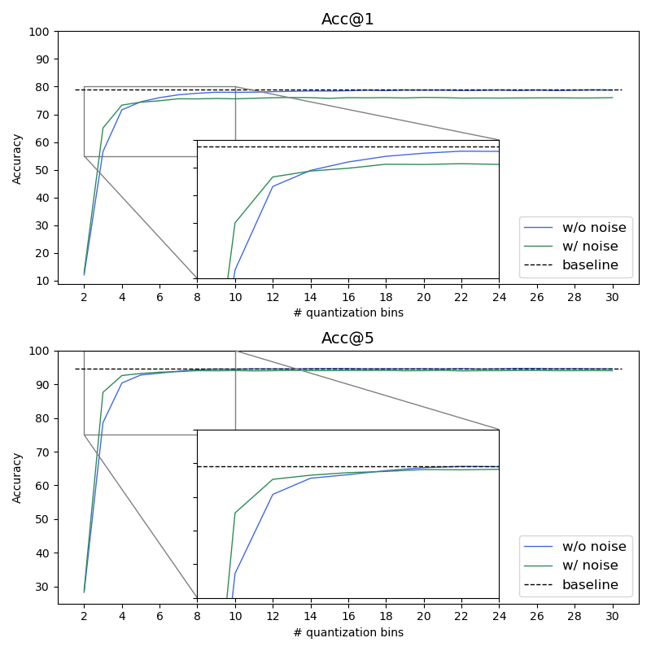
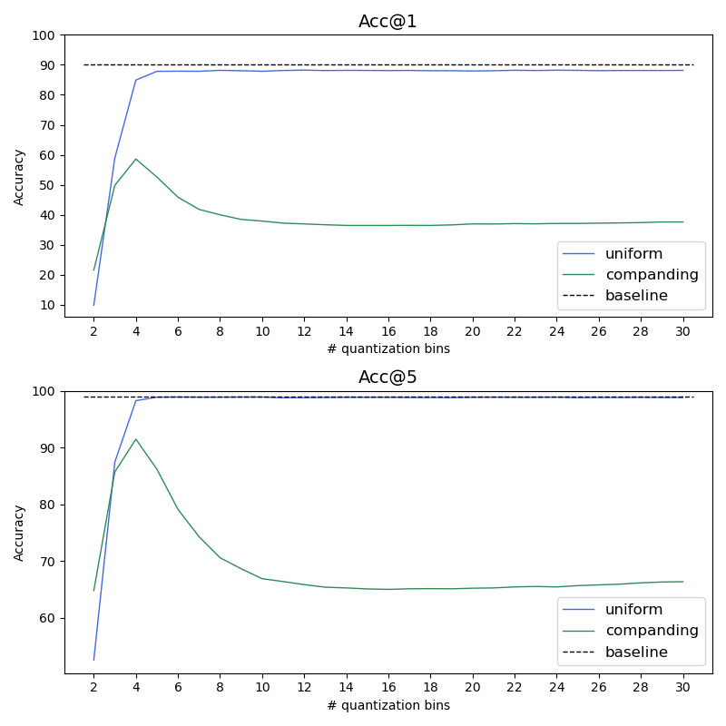

## Accuracy

### Baseline
| Dataset      |  Acc@1   |  Acc@5   |
|--------------|:--------:|:--------:|
| *CIFAR100*   |  78.820  |  94.560  |
| *Imagenette* |  90.242  |  99.083  |

 

### Comparison of different splits
> **_NOTE:_** Split@N means that the split was made after the N-th residual block.

 

**Dataset**: CIFAR100 
**Model**: QuantResNet101 trained *WITHOUT* noise

 

**Dataset**: CIFAR100 
**Model**: QuantResNet101 trained *WITH* noise

 

**Dataset**: Imagenette 
**Model**: QuantResNet101 trained *WITHOUT* noise

 

**Dataset**: Imagenette 
**Model**: QuantResNet101 trained *WITH* noise

 

### *NOISE* vs *NO NOISE* training

**Imagenette**

 

**CIFAR100**

 

### *Uniform* vs *Non-uniform* quantization

 

### Comparison of training regime

When training a model with noise to approximate quantization error, one would expect that you need to train 
different models for each split *i.e.* if we split the model after the first residual block (split@1), we would train
a model that injects noise after the first residual block, and if we split the model after the second residual block
(split@2) we would train a model that injects noise after the second residual block. However it would seem that it
does not matter where we inject the noise during training as long as it is within the same layer of residual blocks 
(ResNet101 has a layer distribution of [3, 4, 23, 3]).

The blue and green line represent models that were trained with noise injected after the first residual block.
The red line represent a model that was trained with noise injected after the second residual block. As you can see
There are no significant differences between the green and red line as one would expect.

## Computational complexity

**GFLOPS** ... Giga Floating point operations **per second** 
**GFLOPs** ... Giga Floating point operations 

| Device                  | GFLOPS |
|-------------------------|:------:|
| *Raspberry Pi-4B*       |  9.69  |
| *Raspberry Pi Zero 2 W* |  5.10  |
| *NVIDIA A100*           | 19 500 |

| CNN                   | GFLOPs  |
|-----------------------|:-------:|
| *ResNet101*           |  7.85   |
| *QuantResNet (Edge)*  |  0.375  |
| *QuantResNet (Cloud)* |  7.49   |

## Compression

> **_NOTE:_** All measurements were made with split@1 on 1500 images from the coressponding dataset.
> I also used the model trained with noise. Whether there is a difference in bpp and CR if I used the model
> trained without noise is unknown, but is suspect there isn't.

**Imagenette**

| qbins |  bpp  |  CR  |
|:-----:|:-----:|:----:|
|  *4*  | 6.36  | 4.07 |
|  *6*  | 12.53 | 1.97 |
|  *8*  | 16.82 | 1.45 |

**CIFAR100**

| qbins |  bpp  |  CR  |
|:-----:|:-----:|:----:|
|  *4*  | 85.81 | 0.29 |
|  *6*  |   -   |  -   |
|  *8*  |   -   |  -   |

## Anonimization

|         Original image         |           Feature maps            | Quantized Feature maps                           |
|:------------------------------:|:---------------------------------:|--------------------------------------------------|
|  |  |  |

